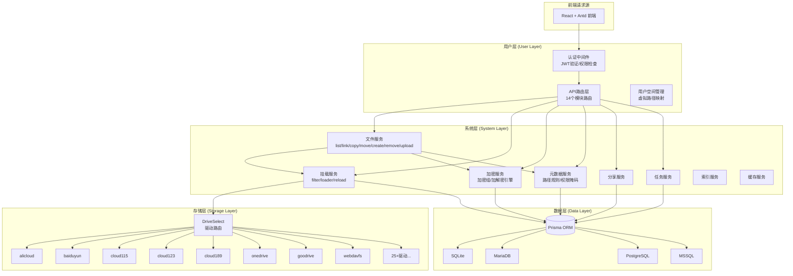
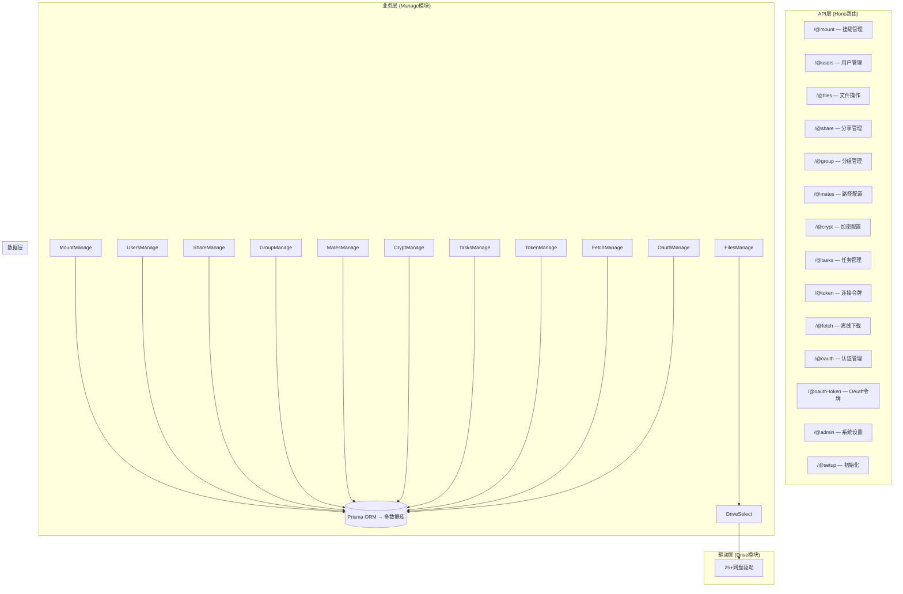
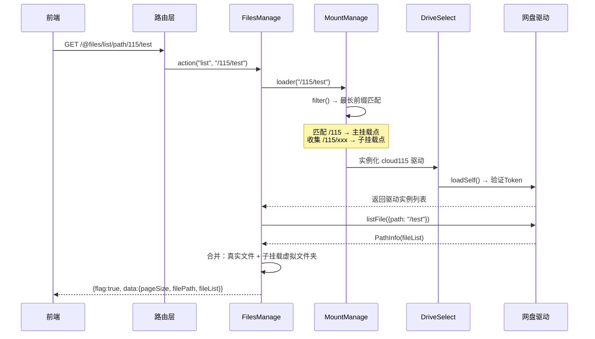
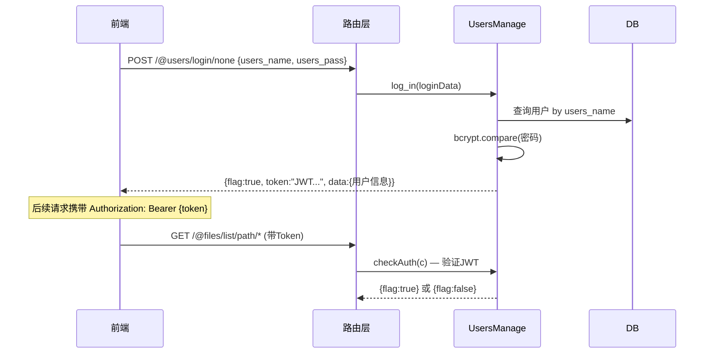
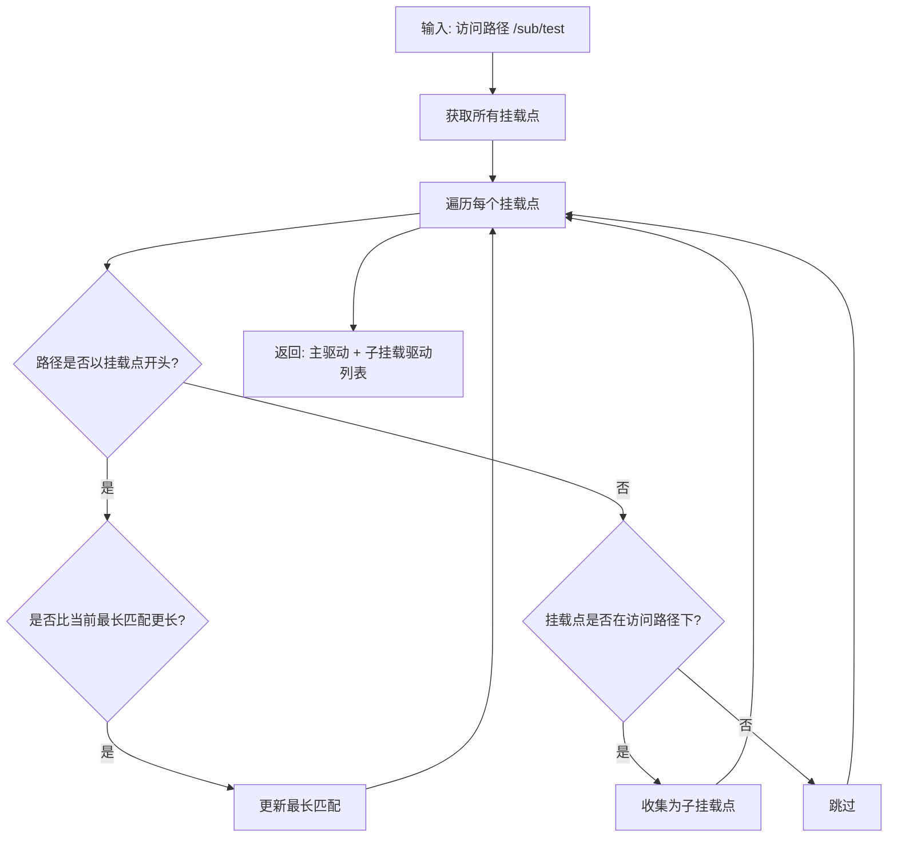
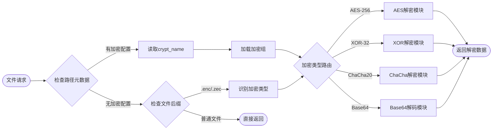

# OpenList 后端逻辑梳理文档 (更新版)

## 一、系统架构总览

### 1.1 目标架构（三层分离）



### 1.2 当前实际架构



---

## 二、API接口完整清单

### 统一请求格式
- **路由格式**: `/@{module}/{action}/{method}/*`
- **action**: 操作类型(select/create/remove/config/status等)
- **method**: 筛选方式(path/uuid/name/none)
- **请求体**: JSON格式的config对象
- **响应格式**: `{flag: boolean, text: string, data?: any}`

---

### 2.1 挂载管理 `/@mount`

| 接口路径 | 方法 | 权限 | 描述 |
|:--------|:-----|:-----|:-----|
| `/@mount/select/none` | GET | 公开 | 查询所有挂载列表 |
| `/@mount/create/none` | POST | 登录 | 创建挂载 (需要mount_path/mount_type/drive_conf) |
| `/@mount/remove/path/*` | POST | 登录 | 删除指定路径的挂载 |
| `/@mount/config/path/*` | POST | 登录 | 修改挂载配置 |
| `/@mount/driver/none` | GET | 公开 | 获取所有可用驱动类型和配置字段 |
| `/@mount/reload/path/*` | POST | 登录 | 重新加载挂载 |

**数据模型 (mount)**:
```typescript
interface MountConfig {
    mount_path: string;   // PK — 挂载路径
    mount_type: string;   // 驱动类型(cloud189/cloud115/alicloud等)
    is_enabled: number;   // 是否启用
    drive_conf: string;   // 驱动配置JSON(包含认证信息)
    drive_save: string;   // 运行时保存数据(token缓存等)
    cache_time: number;   // 缓存时间(秒)
    index_list: number;   // 显示排序
    proxy_mode: number;   // 代理模式(0:直链 1:代理)
    proxy_data: string;   // 代理配置
    drive_logs: string;   // 驱动日志
    drive_tips: string;   // 提示信息
}
```

### 2.2 用户管理 `/@users`

| 接口路径 | 方法 | 权限 | 描述 |
|:--------|:-----|:-----|:-----|
| `/@users/select/none` | GET | 登录 | 查询所有用户 |
| `/@users/create/none` | POST | 公开 | 注册用户 (需要users_name/users_pass) |
| `/@users/remove/name/*` | POST | 登录 | 删除指定用户 |
| `/@users/config/none` | POST | 登录 | 修改用户配置 |
| `/@users/login/none` | POST | 公开 | 用户登录 → 返回JWT Token |
| `/@users/logout/none` | POST | 登录 | 用户登出 |
| `/@users/oauth-unbind/none` | POST | 登录 | 解绑OAuth账户 |

**数据模型 (users)**:
```typescript
interface UsersConfig {
    users_name: string;   // PK — 用户名
    users_mail: string;   // 邮箱
    users_pass: string;   // 密码(SHA2加密)
    users_mask: string;   // 权限掩码(CURD/DAV/FTP/管理)
    is_enabled: number;   // 是否启用
    total_size: number;   // 空间大小
    total_used: number;   // 已用空间
    oauth_data: string;   // 绑定的OAuth信息JSON
    mount_data: string;   // 用户挂载数据JSON
}
```

### 2.3 文件操作 `/@files`

| 接口路径 | 方法 | 权限 | 描述 |
|:--------|:-----|:-----|:-----|
| `/@files/list/path/*` | GET | 登录 | 列出指定路径的文件列表 |
| `/@files/link/path/*` | GET | 登录 | 获取文件下载链接/流 |
| `/@files/copy/path/*?target=` | POST | 登录 | 复制文件 |
| `/@files/move/path/*?target=` | POST | 登录 | 移动文件 |
| `/@files/create/path/*?target=` | POST | 登录 | 创建文件/文件夹 |
| `/@files/remove/path/*` | DELETE | 登录 | 删除文件 |
| `/@files/upload/path/*` | POST | 登录 | 上传文件(multipart) |
| `/@files/rename/path/*?target=` | POST | 登录 | 重命名文件 |

**文件信息结构 (FileInfo)**:
```typescript
interface FileInfo {
    filePath: string;       // 文件路径
    fileName: string;       // 文件名
    fileSize: number;       // 文件大小(bytes)
    fileType: number;       // 0:目录 1:文件
    fileHash?: FileHash;    // 哈希信息(md5/sha1/sha256)
    fileUUID?: string;      // 文件唯一ID
    thumbnails?: string;    // 缩略图URL
    timeModify?: Date;      // 修改时间
    timeCreate?: Date;      // 创建时间
    fileCrypts?: CryptInfo; // 加密信息
}
```

**文件操作流程**:
```
请求 → 路由解析(action/method/path) → FilesManage.action()
  → MountManage.loader(path) → 匹配最长前缀挂载点 + 收集子挂载点
  → DriveSelect → 初始化驱动(loadSelf) → 执行操作(listFile/downFile/...)
  → 合并主驱动文件列表 + 子挂载点虚拟文件夹 → 返回响应
```

### 2.4 分享管理 `/@share`

| 接口路径 | 方法 | 权限 | 描述 |
|:--------|:-----|:-----|:-----|
| `/@share/select/none` | GET | 登录 | 查询所有分享 |
| `/@share/create/none` | POST | 登录 | 创建分享 |
| `/@share/remove/uuid/*` | POST | 登录 | 删除分享 |
| `/@share/config/none` | POST | 登录 | 修改分享配置 |
| `/@share/status/none` | POST | 登录 | 切换分享状态 |
| `/@share/enabled/none` | GET | 登录 | 获取启用的分享 |
| `/@share/user/none` | POST | 登录 | 获取用户的分享 |
| `/@share/validate/none` | POST | 登录 | 验证分享密码 |
| `/@share/password/none` | POST | 登录 | 更新分享密码 |
| `/@share/endtime/none` | POST | 登录 | 更新过期时间 |
| `/@share/expiring/none` | GET | 登录 | 获取即将过期分享 |
| `/@share/cleanup/none` | POST | 登录 | 清理过期分享 |

### 2.5 分组管理 `/@group`

| 接口路径 | 方法 | 权限 | 描述 |
|:--------|:-----|:-----|:-----|
| `/@group/select/none` | GET | 登录 | 查询所有分组 |
| `/@group/create/none` | POST | 登录 | 创建分组 |
| `/@group/remove/name/*` | POST | 登录 | 删除分组 |
| `/@group/config/none` | POST | 登录 | 修改分组配置 |
| `/@group/toggle/name/*` | POST | 登录 | 切换分组状态 |
| `/@group/mask/none` | POST | 登录 | 更新分组权限掩码 |
| `/@group/enabled/none` | GET | 登录 | 获取启用的分组 |

### 2.6 路径配置 `/@mates`

| 接口路径 | 方法 | 权限 | 描述 |
|:--------|:-----|:-----|:-----|
| `/@mates/select/none` | GET | 登录 | 查询所有路径配置 |
| `/@mates/create/none` | POST | 登录 | 创建路径规则 |
| `/@mates/remove/name/*` | POST | 登录 | 删除路径规则 |
| `/@mates/config/none` | POST | 登录 | 修改路径配置 |
| `/@mates/status/none` | POST | 登录 | 切换路径规则状态 |
| `/@mates/enabled/none` | GET | 登录 | 获取启用的路径配置 |

**数据模型 (mates)**:
```typescript
interface MatesConfig {
    mates_name: string;   // PK — 路径名(如/path1/)
    mates_mask: number;   // 权限掩码(16bits)
    mates_user: number;   // 所有者
    is_enabled: number;   // 是否启用
    dir_hidden: number;   // 是否隐藏
    dir_shared: number;   // 是否共享
    set_zipped: string;   // 压缩配置JSON
    set_parted: string;   // 分卷配置JSON
    crypt_name: string;   // 关联的加密组名称
    cache_time: number;   // 缓存时间
}
```

### 2.7 加密配置 `/@crypt`

| 接口路径 | 方法 | 权限 | 描述 |
|:--------|:-----|:-----|:-----|
| `/@crypt/select/none` | GET | 登录 | 查询所有加密配置 |
| `/@crypt/create/none` | POST | 登录 | 创建加密组 |
| `/@crypt/remove/name/*` | POST | 登录 | 删除加密组 |
| `/@crypt/config/none` | POST | 登录 | 修改加密配置 |
| `/@crypt/status/none` | POST | 登录 | 切换加密组状态 |
| `/@crypt/enabled/none` | GET | 登录 | 获取启用的加密组 |
| `/@crypt/user/none` | POST | 登录 | 获取用户的加密组 |

**数据模型 (crypt)**:
```typescript
interface CryptConfig {
    crypt_name: string;   // PK — 加密组名称
    crypt_pass: string;   // 主密码
    crypt_type: number;   // 加密类型(0:BASE64 1:AES256 2:XOR-32 3:CHACHA)
    crypt_mode: number;   // 加密模式(4位编码)
    is_enabled: number;   // 是否启用
    crypt_self: number;   // 自我解密(CRC32做密钥)
    rands_pass: number;   // 随机密钥
    oauth_data: string;   // 三方认证数据JSON
    write_name: string;   // 后缀名称(enc/zec等)
}
```

### 2.8 任务管理 `/@tasks`

| 接口路径 | 方法 | 权限 | 描述 |
|:--------|:-----|:-----|:-----|
| `/@tasks/select/none` | GET | 登录 | 查询所有任务 |
| `/@tasks/create/none` | POST | 登录 | 创建任务 |
| `/@tasks/remove/uuid/*` | POST | 登录 | 删除任务 |
| `/@tasks/status/none` | POST | 登录 | 更新任务状态 |
| `/@tasks/user/none` | POST | 登录 | 获取用户任务 |
| `/@tasks/byStatus/none` | POST | 登录 | 按状态查询任务 |

### 2.9 连接令牌 `/@token`

| 接口路径 | 方法 | 权限 | 描述 |
|:--------|:-----|:-----|:-----|
| `/@token/select/none` | GET | 登录 | 查询所有令牌 |
| `/@token/create/none` | POST | 登录 | 创建连接令牌 |
| `/@token/remove/uuid/*` | POST | 登录 | 删除令牌 |
| `/@token/status/none` | POST | 登录 | 切换令牌状态 |
| `/@token/user/none` | POST | 登录 | 获取用户令牌 |
| `/@token/enabled/none` | GET | 登录 | 获取启用的令牌 |

### 2.10 离线下载 `/@fetch`

| 接口路径 | 方法 | 权限 | 描述 |
|:--------|:-----|:-----|:-----|
| `/@fetch/select/none` | GET | 登录 | 查询所有下载任务 |
| `/@fetch/create/none` | POST | 登录 | 创建下载任务 |
| `/@fetch/remove/uuid/*` | POST | 登录 | 删除下载任务 |
| `/@fetch/status/none` | POST | 登录 | 更新下载状态 |
| `/@fetch/user/none` | POST | 登录 | 获取用户下载任务 |
| `/@fetch/download/none` | POST | 登录 | 获取待下载任务 |

### 2.11 OAuth认证 `/@oauth` / `/@oauth-token`

| 接口路径 | 方法 | 权限 | 描述 |
|:--------|:-----|:-----|:-----|
| `/@oauth/select/none` | GET | 登录 | 查询所有OAuth配置 |
| `/@oauth/create/none` | POST | 登录 | 创建OAuth配置 |
| `/@oauth/remove/name/*` | POST | 登录 | 删除OAuth配置 |
| `/@oauth/enabled/none` | GET | 登录 | 获取启用的OAuth |
| `/@oauth/validate/name/*` | POST | 登录 | 验证OAuth配置 |
| `/@oauth-token/authurl/name/*` | POST | 公开 | 生成授权URL |
| `/@oauth-token/callback/name/*` | POST | 公开 | OAuth回调处理 |
| `/@oauth-token/bind/name/*` | POST | 公开 | 绑定OAuth账户 |

### 2.12 系统管理 `/@admin`

| 接口路径 | 方法 | 权限 | 描述 |
|:--------|:-----|:-----|:-----|
| `/@admin/select/none` | GET | 管理员 | 查询全局设置 |
| `/@admin/config/none` | POST | 管理员 | 修改全局设置 |

### 2.13 系统初始化 `/@setup`

| 接口路径 | 方法 | 权限 | 描述 |
|:--------|:-----|:-----|:-----|
| `/@setup/status/none` | GET | 公开 | 检查系统是否已初始化 |
| `/@setup/init/none` | POST | 公开 | 执行系统初始化(创建表和默认数据) |

---

## 三、网盘驱动接口

### 3.1 支持的网盘驱动 (25+)

| 驱动标识 | 名称 | 认证方式 | 特性 |
|:---------|:-----|:---------|:-----|
| cloud189 | 天翼云盘 | 账号密码/Cookie/二维码 | 家庭云/个人云/秒传 |
| cloud189pc | 天翼云盘PC | 账号密码 | PC端API |
| cloud139 | 移动云盘 | Authorization | 个人云/家庭云/群组云 |
| cloud115 | 115云盘 | Token | 请求限流 |
| cloud115open | 115云盘Open | OAuth2 | Open API |
| cloud123 | 123云盘 | OAuth2 | 直链下载 |
| cloud123open | 123云盘Open | OAuth2 | Open API |
| alicloud | 阿里云盘 | OAuth2 | 资源库/备份盘/秒传 |
| baiduyun | 百度网盘 | OAuth2 | 破解API |
| baidu_netdisk | 百度网盘 | OAuth2 | 官方API |
| onedrive | OneDrive | OAuth2 | 全球版/世纪互联/SharePoint |
| goodrive | Google Drive | OAuth2 | 在线API支持 |
| webdavfs | WebDAV | 账号密码 | 坚果云/NextCloud等 |
| s3drive | S3兼容 | AccessKey | AWS/MinIO/阿里OSS等 |
| seafile | Seafile | 账号密码 | 自建网盘 |
| sftpdrive | SFTP | 账号密码 | SSH文件传输 |
| teldrive | TelDrive | API Key | Telegram存储 |
| pikpak | PikPak | OAuth2 | 离线下载 |
| terabox | TeraBox | Cookie | 百度海外版 |
| thunderx | 迅雷X | OAuth2 | 离线下载 |
| cloudreve4 | Cloudreve v4 | 账号密码 | 自建网盘 |
| openlist | OpenList | API Key | 聚合挂载 |
| neteasemusic | 网易云音乐 | Cookie | 音乐云盘 |
| weiyun | 微云 | Cookie | 腾讯微云 |
| wopan | 沃盘 | 账号密码 | 联通网盘 |
| yandexdisk | Yandex Disk | OAuth2 | 俄罗斯网盘 |
| quarkopen | 夸克网盘Open | OAuth2 | Open API |

### 3.2 统一驱动接口 (每个驱动必须实现)

```typescript
interface DriverInterface {
    // 基础属性
    config: Record<string, any>;  // 驱动配置
    saving: Record<string, any>;  // 运行时数据
    change: boolean;              // 是否有变更需要保存
    router: string;               // 挂载路径
    
    // 生命周期
    initSelf(): Promise<DriveResult>;     // 初始化驱动(首次配置)
    loadSelf(): Promise<DriveResult>;     // 加载驱动(获取凭证)
    
    // 文件操作
    listFile(params: {path: string}): Promise<PathInfo>;
    downFile(params: {path: string}): Promise<FileLink[]>;
    pushFile(params: {path: string}, name: string, type: FileType, file: any): Promise<FileTask>;
    makeFile(params: {path: string}, name: string, type: FileType): Promise<FileTask>;
    killFile(params: {path: string}): Promise<FileTask>;
    copyFile(source: {path: string}, target: {path: string}): Promise<FileTask>;
    moveFile(source: {path: string}, target: {path: string}): Promise<FileTask>;
}
```

### 3.3 驱动文件结构 (每个驱动包含4个文件)

```
src/drive/{driver_name}/
├── const.ts   — 常量定义(API地址、默认配置等)
├── files.ts   — 驱动主实现(实现统一接口,继承BasicClouds)
├── metas.ts   — 驱动元信息(名称、描述、配置字段定义)
└── utils.ts   — 工具函数(请求封装、签名计算、Token刷新等)
```

### 3.4 驱动基类

```typescript
// BasicClouds — 所有驱动的基类
class BasicClouds {
    config: Record<string, any>;   // 驱动配置
    saving: Record<string, any>;   // 运行时数据
    change: boolean;               // 是否需要保存
    router: string;                // 挂载路径
    c: Context;                    // Hono上下文
    
    getSaves(): Promise<any>;      // 从数据库读取配置
    putSaves(): Promise<any>;      // 保存配置到数据库
}
```

---

## 四、数据库表结构

共13张表，详见 `schema.sql` 和 `prisma/schema.prisma`：

| 表名 | 用途 | 主键 | 关键字段 |
|:-----|:-----|:-----|:---------|
| mount | 挂载路径 | mount_path | mount_type, drive_conf, proxy_mode |
| users | 用户信息 | users_name | users_pass, users_mask, total_size |
| oauth | OAuth配置 | oauth_name | oauth_type, oauth_data |
| binds | OAuth绑定 | oauth_uuid | oauth_name, binds_user |
| crypt | 加密配置 | crypt_name | crypt_pass, crypt_type, crypt_mode |
| mates | 元数据配置 | mates_name | mates_mask, crypt_name, set_zipped |
| share | 分享配置 | share_uuid | share_path, share_pass, share_ends |
| token | 连接令牌 | token_uuid | token_path, token_type |
| tasks | 任务配置 | tasks_uuid | tasks_type, tasks_flag |
| fetch | 离线下载 | fetch_uuid | fetch_from, fetch_dest |
| group | 用户分组 | group_name | group_mask |
| cache | 缓存信息 | cache_path | cache_info, cache_time |
| admin | 全局设置 | admin_keys | admin_data |

---

## 五、核心业务流程

### 5.1 文件列表流程



### 5.2 认证流程



### 5.3 挂载点匹配算法



### 5.4 加密执行流程（规划）



---

## 六、模块实现状态

| 模块 | CRUD | 业务逻辑 | 状态 |
|:-----|:-----|:---------|:-----|
| MountManage | ✅完整 | ✅ filter/loader/reload | 生产就绪 |
| UsersManage | ✅完整 | ✅ login/logout/checkAuth | 生产就绪 |
| FilesManage | ✅完整 | ✅ list/link/copy/move/create/remove/upload | 生产就绪 |
| ShareManage | ✅完整 | ✅ validate/password/cleanup | 生产就绪 |
| GroupManage | ✅完整 | ✅ toggle/mask | 生产就绪 |
| MatesManage | ✅完整 | ⚠️ CRUD完整但未集成到文件操作流程 | 需完善 |
| CryptManage | ✅完整 | ❌ 仅CRUD，无实际加解密引擎 | 需开发 |
| TasksManage | ✅完整 | ⚠️ 基础CRUD | 需完善 |
| TokenManage | ✅完整 | ⚠️ 基础CRUD | 需完善 |
| FetchManage | ✅完整 | ⚠️ 基础CRUD | 需完善 |
| OauthManage | ✅完整 | ✅ validate/callback/bind | 生产就绪 |
| AdminManage | ✅基础 | ⚠️ 简单KV存取 | 需完善 |
