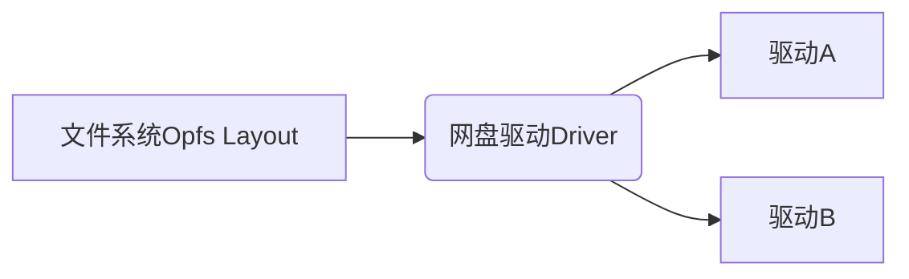
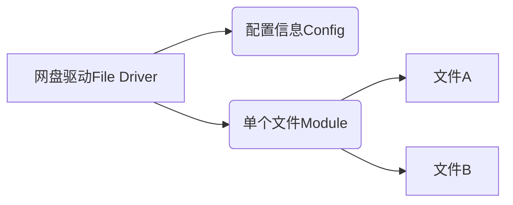
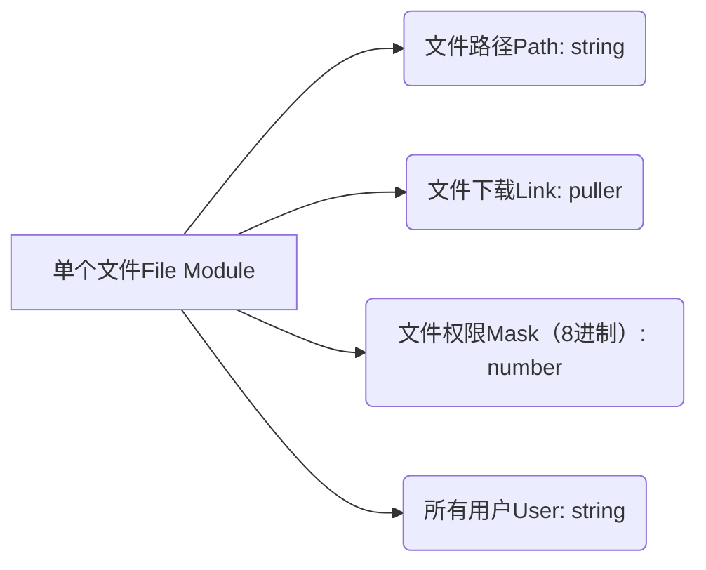
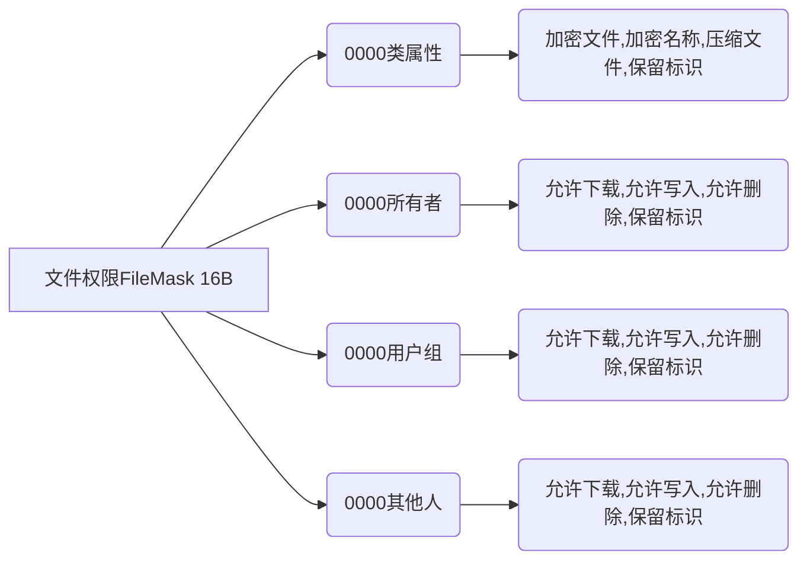
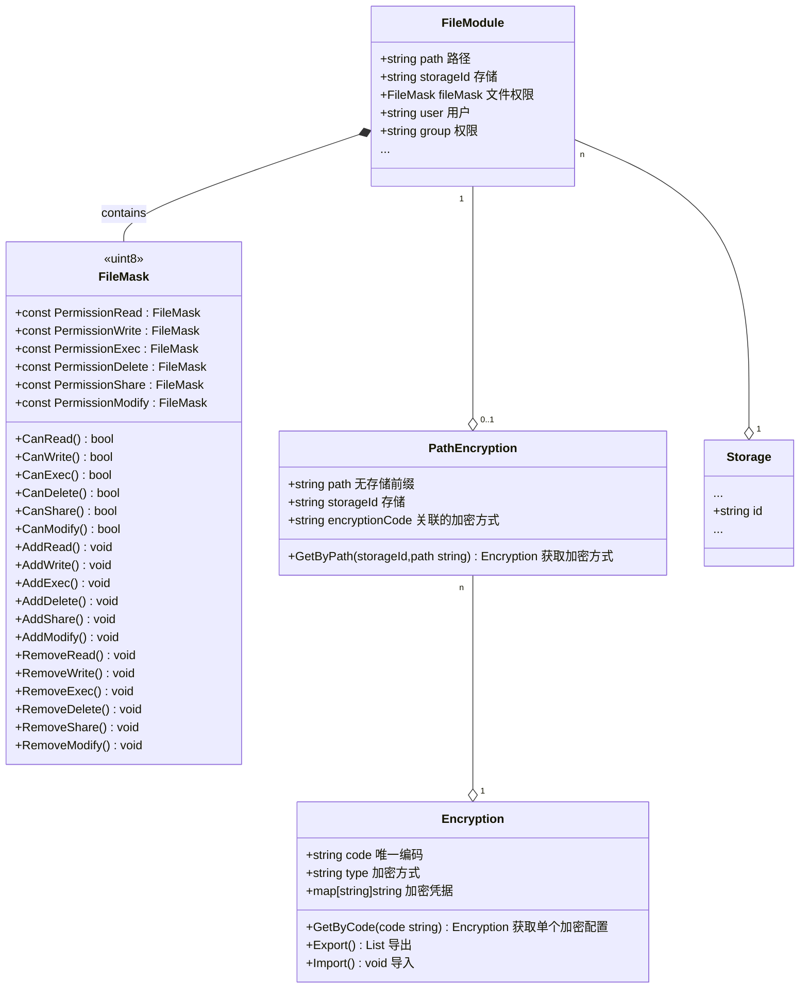
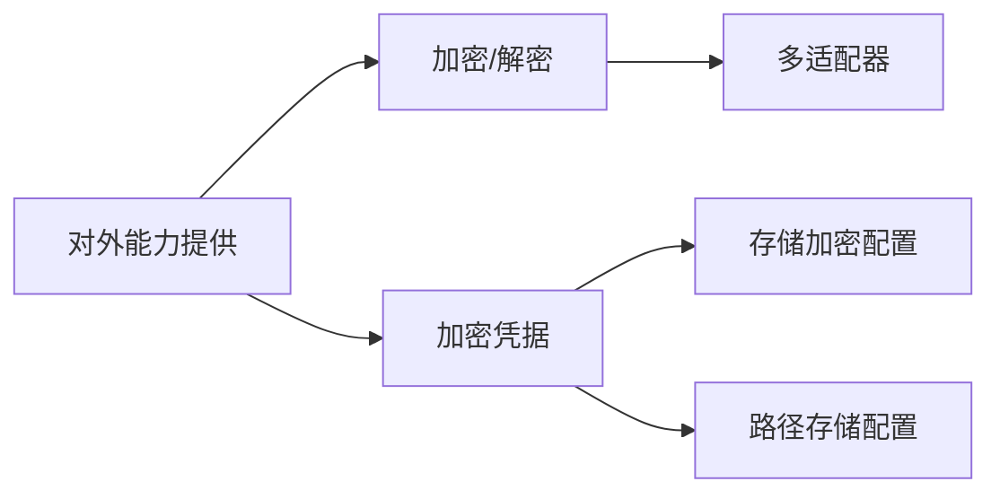
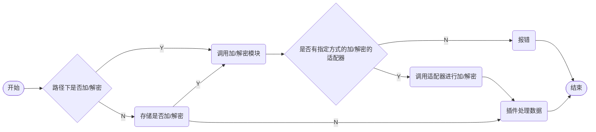

# OpenList 文件架构设计

> [文件系统Opfs Layout]

> [网盘驱动File Driver]

> [单个文件File Module]

> [File Mask]

> 类图

**此处考虑迁移**
1. 使用code/path关联
2. 文件路径拆分为path+storageId

-> 参考示例：[FileMash.go](https://gist.github.com/dezhishen/4a61dc2ee8d4f2ef69eab1be1027fde4#file-filemask-go)
> 加/解密模块

> 加/解密流程

