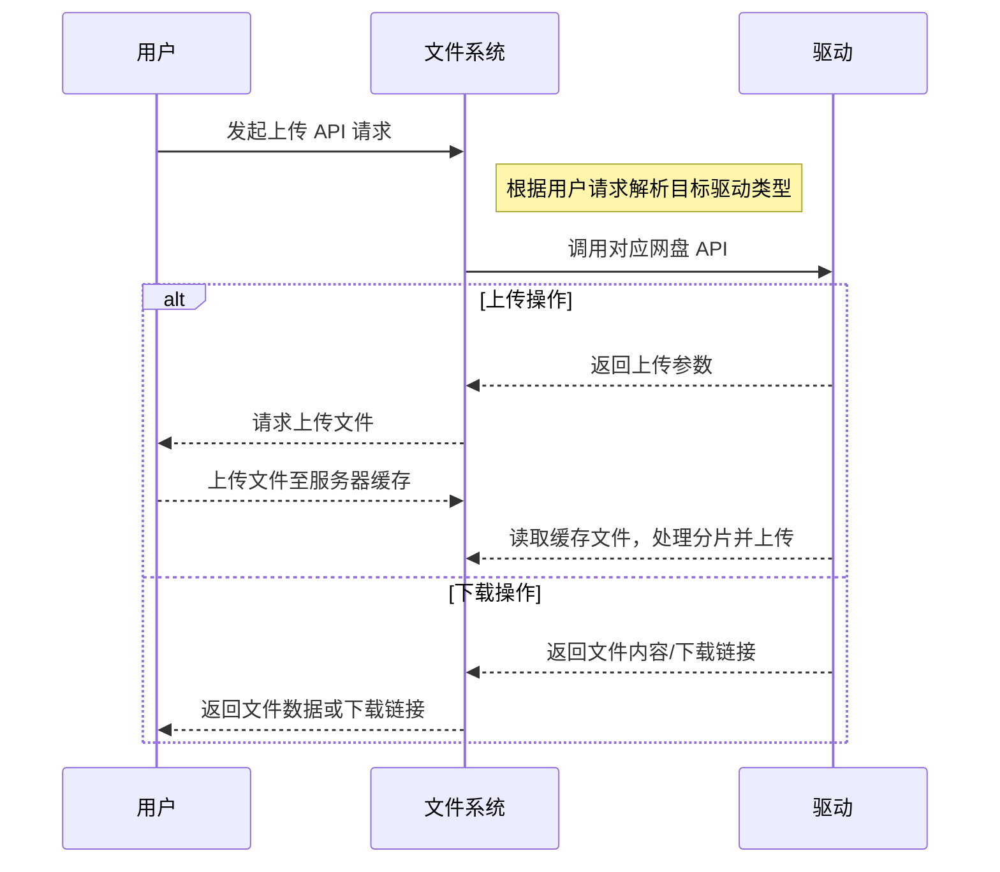

# OpenList 文件系统功能

## 文件系统和驱动图

## 文件系统功能列表

### 文件信息

- `File_Name`：文件名
- `File_Path`：文件在驱动内的路径的地址，由核心负责处理为文件系统内的真实地址到和驱动之间通信的双向转换。
    对于挂载到`/115`的驱动插件，传递的是：`File_Path："/test"`，核心内应为：`/115/test`；
    对于挂载到`/ali`的驱动插件，传递的是：`File_Path："/home/file.bin"`，核心内应为：`/home/file.bin`
- `Driver`: 挂载的驱动名和驱动类型，最好也是结构体，用于识别驱动和处理真实文件路径
- `IsDir`:用于判断是否是是文件夹
- `File_id`: 网盘端传回的文件唯一id，可选配置
- `Hashinfo`：最好为结构体，`type`：用于指明散列值的类型，`id`：用于指明散列值的值，可以用于跨盘秒传，可选配置

### 权限管理

待定

###

### 统一化接口

- 下载文件：适用于向驱动要求下载文件。

- 上传：适用于向驱动要求上传文件

## 驱动对接功能列表

### 下载

#### 链接下载

- 由核心向驱动发起，传递文件信息。

- 返回下载方式和真实下载的结构体，内部应该包含`Direct_URL`、`User_Agent`等用于构造下载的参数。
- 需要核心提供`File_id`，以便驱动获取到下载地址。

#### 插件代理下载

- 由核心向驱动发起，传递文件信息
- 驱动向核心返回下载方式和mmap等映射地址。
- 插件自身完成下载，保存到本地文件
- 宿主基于文件的mmap映射/sendfile等
### 上传

#### 基于文件级别的缓存

- 由核心主动向驱动发起链接，应包含前端可以立即收集到的文件信息。
- 驱动收集到后向核心发送确认信号，并包含由驱动负责提供的临时文件名。
- 核心需要先上传文件至服务器，上传完成后再次通知再由驱动负责将其分片处理和上传。在统一的临时文件目录下读取。

统一分片上传的方法：https://mds.oplist.org.cn/s/7VcMU06b7

#### 浏览器前端分片

https://mds.oplist.org.cn/s/JjZE9n6mg

### 同网盘复制/移动

- 通过函数传递两个文件的结构，需要`Driver`字段相同，驱动处理`File_Path`、`File_Name`、`IsDir`等信息

### 跨网盘复制/移动

#### 服务器代理

- 先下载后上传，交由核心处理

#### 秒传接口

- 需要驱动预定义支持的驱动名，由驱动处理`Hashinfo`信息
