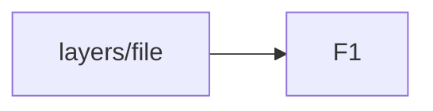
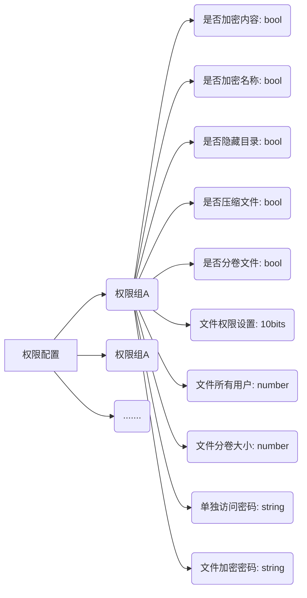
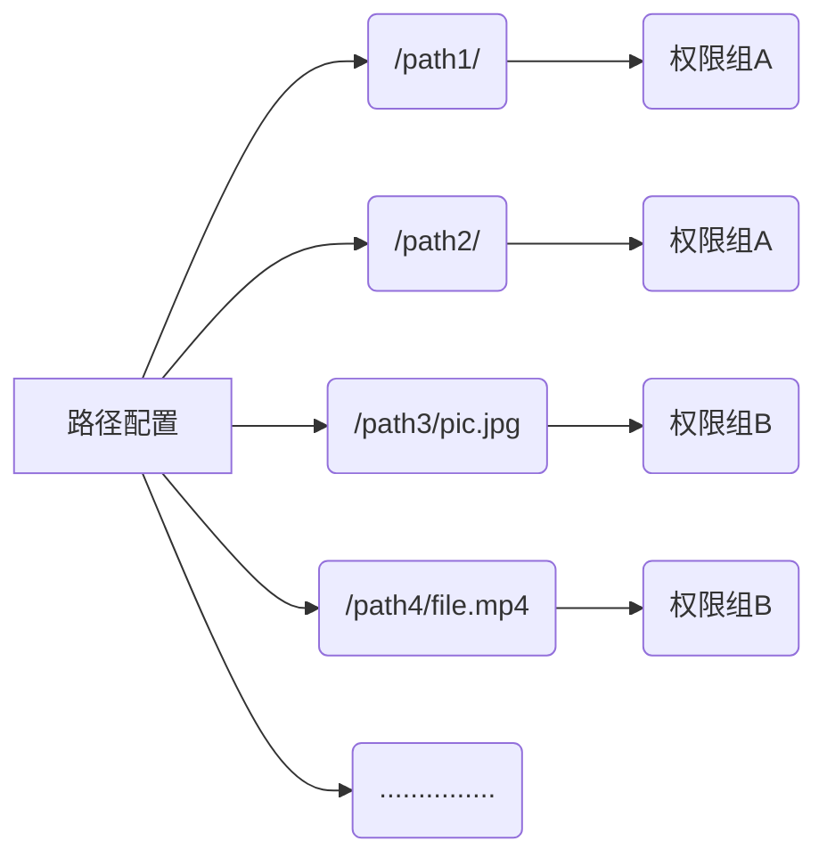
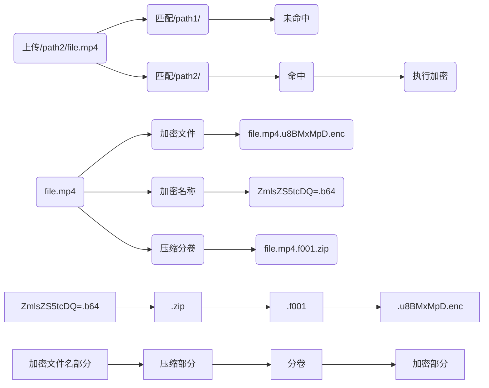
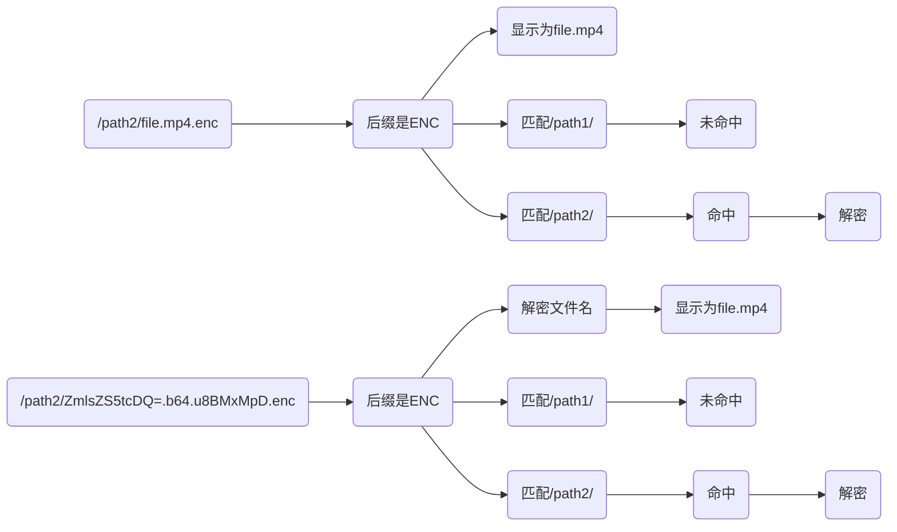

# OpenList 文件系统架构

## 文件系统代码

## 文件配置详情

1、路径加密每一个路径不能重叠，添加的时候需要遍历扫描
2、如果加密文件内容，必须输入密码，只加密文件名不需要
3、需要有个默认权限：默认不加密且公开，但是可以修改它

> 文件配置页面

> 加密执行流程

压缩加密后缀：ZEC，只加密文件的：ENC，只压缩的后缀ZIP
PS：如果都没有命中，当然是不加密/压缩直接上传原始文件

> 文件访问流程

PS：如果匹配不上并且文件加密，需要输入密码

