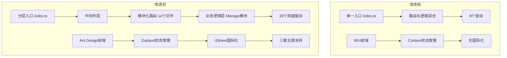

# OpenList-TSWorker 架构修改与优化总结

> 文档版本：2026-03-05  
> 涉及范围：后端架构、前端 UI 框架、驱动扩展、中间件、状态管理、国际化

---

## 一、总体架构升级

### 1.1 后端入口重构 (`src/index.ts`)

**变更前**：所有路由和中间件在 `src/index.ts` 中混合注册，缺少分层设计。

**变更后**：新建 `src/index.ts` 作为应用入口，采用清晰的三层架构：

```
用户层(认证/路由) → 系统层(业务逻辑/Manage模块) → 存储层(网盘驱动)
```

- 中间件按执行顺序统一注册（错误处理 → CORS → 日志 → 认证）
- 路由模块按功能分组注册（存储管理、用户管理、文件操作、安全管理等）
- `wrangler.jsonc` 入口指向从 `src/index.ts` 改为 `src/index.ts`

### 1.2 中间件体系建立 (`src/middleware/index.ts`)

**新增**独立的中间件模块，包含：

| 中间件 | 功能 |
|--------|------|
| `authMiddleware` | JWT 认证，支持公开路由白名单，自动将用户信息注入上下文 |
| `adminMiddleware` | 管理员权限校验 |
| `corsMiddleware` | 跨域请求处理 |
| `loggerMiddleware` | 请求日志记录（仅开发环境） |
| `errorMiddleware` | 全局异常捕获与统一错误响应 |

### 1.3 路由模块化 (`src/routes/`)

将原来集中式的路由拆分为独立模块文件：

```
src/routes/
├── admin.ts        # 系统管理
├── crypt.ts        # 加密配置
├── fetch.ts        # 离线下载
├── files.ts        # 文件操作
├── group.ts        # 分组权限
├── mates.ts        # 路径配置
├── mount.ts        # 挂载管理
├── oauth.ts        # OAuth 认证
├── oauthToken.ts   # OAuth 令牌
├── setup.ts        # 系统初始化
├── share.ts        # 分享管理
├── tasks.ts        # 任务管理
├── token.ts        # 连接令牌
└── users.ts        # 用户管理
```

---

## 二、网盘驱动大规模扩展

### 2.1 新增 14 个网盘驱动

在 `src/drive/DriveSelect.ts` 中注册，每个驱动遵循统一的四文件结构（`const.ts`、`metas.ts`、`utils.ts`、`files.ts`）：

| 驱动标识 | 名称 | 目录 |
|----------|------|------|
| `cloudreve4` | Cloudreve V4 | `src/drive/cdrevev4/` |
| `neteasemusic` | 网易云音乐 | `src/drive/neteases/` |
| `openlist` | OpenList/AList | `src/drive/openlist/` |
| `pikpak` | PikPak | `src/drive/pikpakv1/` |
| `quarkopen` | 夸克网盘(开放平台) | `src/drive/quarkpan/` |
| `s3drive` | Amazon S3 及兼容存储 | `src/drive/s3_drive/` |
| `seafile` | Seafile 私有云盘 | `src/drive/seafiles/` |
| `sftpdrive` | SFTP | `src/drive/sftppath/` |
| `terabox` | TeraBox(百度国际版) | `src/drive/teraboxs/` |
| `teldrive` | Telegram Drive | `src/drive/teldrive/` |
| `thunderx` | 迅雷网盘 | `src/drive/thunderx/` |
| `weiyun` | 腾讯微云 | `src/drive/weicloud/` |
| `wopan` | 联通沃盘 | `src/drive/wopanyun/` |
| `yandexdisk` | Yandex Disk | `src/drive/yandexv1/` |

同时为每个驱动在 `config_list` 中添加了完整的表单配置，支持前端动态渲染配置界面。

### 2.2 百度网盘驱动重构 (`src/drive/baidu_netdisk/`)

**变更范围**：`files.ts`（1213 行变动）、`utils.ts`（639 行变动）、`const.ts`、`metas.ts`

#### 主要改进：

- **代码中文化**：将英文注释全部替换为中文注释，提升团队协作可读性
- **架构分层优化**：
  - `HostDriver` 中通过 `declare` 明确声明 `clouds` 和 `config` 的具体类型，消除 `as` 类型断言
  - 文件列表、下载、上传等操作的逻辑更多下沉到 `HostClouds` 工具类中
- **常量重构**（`const.ts`）：
  - 使用 TypeScript `enum` 替代简单常量（`DownloadAPIType`、`VipType`、排序选项等）
  - API 端点常量重命名，语义更清晰
- **简化初始化流程**：`initSelf()` 和 `loadSelf()` 逻辑精简，去除冗余的条件判断

### 2.3 115 云盘 Token 自动刷新 (`src/drive/cloud115/utils.ts`)

- **新增 `refreshToken()` 方法**：基于 OAuth2 接口实现 `refresh_token` → `access_token` 刷新
- **自动重试机制**：`request()` 方法新增 `_retry` 参数，当检测到 Token 失效（`errcode` 401/99）时自动刷新并重试请求，避免用户手动干预

---

## 三、后端稳健性修复

### 3.1 空值安全检查

在以下模块中增加 `result.data` 的空值检查，防止 `undefined.length` 导致崩溃：

- `src/mount/MountManage.ts`：`result.data && result.data.length > 0`
- `src/saves/SavesManage.ts`：同上
- 涉及挂载查询、数据保存等核心流程

### 3.2 请求参数解析兼容 (`src/types/HonoParsers.ts`)

`getConfig()` 函数增加双格式兼容：
- 直接发送数据 `{ key: value }`
- 包裹在指定字段中 `{ config: { key: value } }`

### 3.3 用户创建默认密码 (`src/users/UsersManage.ts`)

用户创建时，若未提供密码则默认设为 `"admin"`，避免空密码导致验证失败。

---

## 四、前端 UI 框架迁移

### 4.1 从 MUI 迁移到 Ant Design

**这是本次最大的前端变更**，涉及 25+ 个组件文件全面重写。

| 维度 | 变更前 | 变更后 |
|------|--------|--------|
| UI 框架 | MUI (Material UI) v7 | Ant Design v5 |
| 样式方案 | Emotion (`@emotion/react`, `@emotion/styled`) | Less + Ant Design Token |
| 图标库 | `@mui/icons-material` | `@ant-design/icons` |
| 高级组件 | — | `@ant-design/pro-components` |
| 状态管理 | React Context (AppContext) | Zustand v5 |
| 国际化 | 无 | `i18next` + `react-i18next` |
| 日期处理 | — | `dayjs` |
| 项目名称 | `pages` | `openlist-frontend` |
| 项目版本 | `0.0.0` | `1.0.0` |

### 4.2 全局状态管理 (`pages/src/store/index.ts`)

基于 Zustand 实现四个独立的持久化 Store：

| Store | 功能 | 持久化 Key |
|-------|------|-----------|
| `useThemeStore` | 主题偏好（light/dark/transparent/system） | `openlist-theme` |
| `useLangStore` | 语言设置 | `openlist-lang` |
| `useAuthStore` | 用户认证状态（token、用户信息） | `openlist-auth` |
| `useSidebarStore` | 侧边栏折叠/移动端/激活分组 | `openlist-sidebar` |

### 4.3 国际化支持 (`pages/src/i18n/index.ts`)

- 完整的中英文双语言包，覆盖所有 UI 文案
- 模块化的翻译键设计（`common`、`sidebar`、`files`、`mount`、`user`、`crypt`、`mates`、`share`、`theme`、`login`）
- 自动从 Zustand Store 读取用户语言偏好

### 4.4 主题系统重构 (`pages/src/theme/`)

- 原 MUI 主题配置（`lightTheme`/`darkTheme`）全部移除
- 新增 `antdTheme.ts`，基于 Ant Design Token 系统实现三套主题：
  - **浅色模式** (`lightTheme`)
  - **深色模式** (`darkTheme`)
  - **透明模式** (`transparentTheme`)
- 通过 `getThemeConfig()` 函数动态获取主题配置

### 4.5 重写的组件列表

**公共组件** (`pages/src/components/`)：
- `MainLayout.tsx` — 主布局（Layout → Ant Design Layout）
- `GroupedSidebar.tsx` — 分组侧边栏
- `DataTable.tsx` — 数据表格
- `ResponsiveDataTable.tsx` — 响应式数据表格
- `DownloadProgress.tsx` — 下载进度
- `FileOperationDialogs.tsx` — 文件操作对话框
- `FileUploadDialog.tsx` — 文件上传对话框
- `OAuthBinding.tsx` — OAuth 绑定
- `UserDialog.tsx` — 用户弹窗

**页面** (`pages/src/pages/`)：
- `Admin/` — 关于平台、分组管理、挂载管理、OAuth 管理、站点设置、用户管理
- `Files/` — 文件管理器、文件预览
- `Users/` — 账户设置、连接配置、加密配置、路径配置、离线下载、任务配置
- `Login/AuthPage.tsx` — 登录/注册页
- `OAuth/OAuthCallback.tsx` — OAuth 回调

---

## 五、新增功能模块

### 5.1 压缩服务 (`src/compress/CompressService.ts`)

新增文件压缩/解压服务。

### 5.2 加密引擎 (`src/crypt/CryptEngine.ts`)

新增独立的加密引擎模块。

### 5.3 路径规则服务 (`src/mates/PathRuleService.ts`)

新增路径规则服务，前端对应 `pages/src/pages/Admin/PathRules.tsx` 页面。

---

## 六、变更统计

| 维度 | 数据 |
|------|------|
| 修改文件数 | 43 |
| 新增文件数 | 30+ |
| 代码增加行 | ~7,113 |
| 代码删除行 | ~7,042 |
| 新增驱动数 | 14 |
| 重写组件数 | 25+ |

---

## 七、架构改进总结



**核心价值**：
1. **可维护性**：路由模块化 + 中间件分离，职责清晰
2. **可扩展性**：统一的驱动接口规范，新增驱动只需四个文件
3. **稳健性**：空值安全检查 + Token 自动刷新 + 全局错误处理
4. **用户体验**：Ant Design 组件体系 + 国际化 + 多主题支持
5. **开发体验**：Zustand 简洁的状态管理 + 中文代码注释
