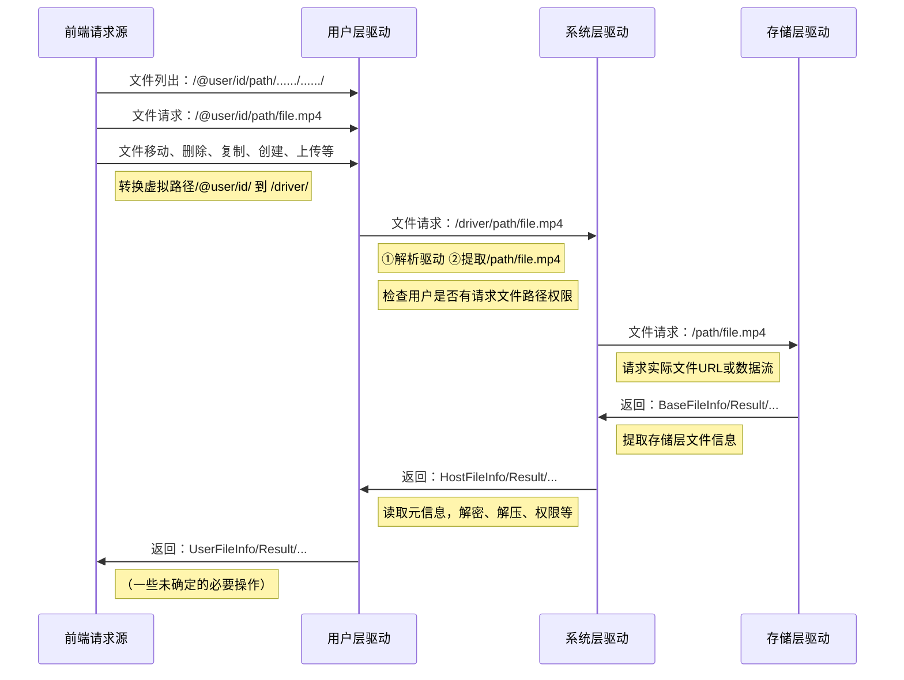

# OpenList 代码架构

```mermaid
sequenceDiagram
    participant 前端请求源
    participant 用户层驱动
    participant 系统层驱动
    participant 存储层驱动
    
    前端请求源->>用户层驱动: 文件列出：/@user/id/path/....../....../
    前端请求源->>用户层驱动: 文件请求：/@user/id/path/file.mp4
    前端请求源->>用户层驱动: 文件移动、删除、复制、创建、上传等
    Note right of  前端请求源: 转换虚拟路径/@user/id/ 到 /driver/
    
    用户层驱动->>系统层驱动: 文件请求：/driver/path/file.mp4
    Note right of  用户层驱动: ①解析驱动 ②提取/path/file.mp4
    Note right of  用户层驱动: 检查用户是否有请求文件路径权限
    
    系统层驱动->>存储层驱动: 文件请求：/path/file.mp4
    Note right of  系统层驱动: 请求实际文件URL或数据流
    
    存储层驱动->>系统层驱动: 返回：BaseFileInfo/Result/...
    Note right of  系统层驱动: 提取存储层文件信息
    
    系统层驱动->>用户层驱动: 返回：HostFileInfo/Result/...
    Note right of  用户层驱动: 读取元信息，解密、解压、权限等
    
    用户层驱动->>前端请求源: 返回：UserFileInfo/Result/...
    Note right of  前端请求源: （一些未确定的必要操作）
    
```