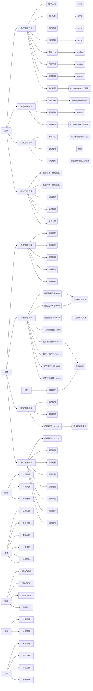

# OpenList 结构设置

## 后端设置

```mermaid
graph LR
A[用户]
    A --> A1[用户管理-列表]
          A1 --> A1T1(用户UUID) --> A1T1U1(string)
          A1 --> A1T2(用户名称) --> A1T2U1(string)
          A1 --> A1T3(用户分组) --> A1T3U1(string)
          A1 --> A1T4(当前密码) --> A1T4U1(string)
          A1 --> A1T5(空间大小) --> A1T5U1(number)
          A1 --> A1T6(已用空间) --> A1T6U1(number)
          A1 --> A1T7(是否启用) --> A1T7U1(boolean)
          A1 --> A1T8(用户权限) --> A1T8U1(CURD/DAV/FTP/管理/..)

    A --> A2[分组权限-列表]
          A2 --> A2T1(分组名称) --> A2T1U1(admin/guest/basic/..)
          A2 --> A2T2(是否启用) --> A2T2U1(boolean)
          A2 --> A2T3(用户权限) --> A2T3U1(CURD/DAV/FTP/管理/..)

    A --> A3[认证方式-列表]
          A3 --> A3T1(登录方式) --> A3T1U1(默认账号密码插件可加)
          A3 --> A3T2(是否启用) --> A3T1U2(bool)
          A3 --> A3T3(认证信息) --> A3T3U3(登录插件可选认证信息)

    A --> A4[私人空间-列表]
          A4 --> A4G1(是否启用（全局选项）)
          A4 --> A4G2(负载均衡（全局选项）)
          A4 --> A4T1(保存路径)
          A4 --> A4T2(是否启用)
          A4 --> A4T3(存储权重)
          A4 --> A4T3(单个上限)


B[存储]
    B --> B1[存储管理-列表]
        B1 --> B1T1(网盘类型)
        B1 --> B1T2(挂载路径)
        B1 --> B1T3(是否启用)
        B1 --> B1T4(工作状态)
        B1 --> B1T5(所属用户)

    B --> B2[路径规则-列表]
        B2 --> B2T3(是否隐藏目录: bool) --> B2T1U2(对所有文件有效)
        B2 --> B2T4(是否压缩文件: bool) --> B2T1U1(只对文件夹有效)
        B2 --> B2T6(是否允许分享: bool) --> B2T1U2(对所有文件有效)
        B2 --> B2T7(文件权限设置: 10bits)
        B2 --> B2T8(文件所有用户: number) --> B3T3U1(默认guest)
        B2 --> B2T9(文件分卷大小: number)
        B2 --> B2TB(文件加密元组: string)
        B2 --> B2TD(缓存时间设置: number)


    B --> B3[路径管理-列表]
        B3 --> B3T1(应用路径（string）) --> B3T1U2(路径可以是文件)
        B3 --> B3T2(是否启用)
        B3 --> B3T3(路径权限)
        //B3 --> B3T4(所属用户) --> B3T3U1(默认admin)

    B --> B4[索引管理-列表]
        B4 --> B4T1(应用路径（string）)
        B4 --> B4T2(是否启用)
        B4 --> B4T3(自动刷新)
        B4 --> B4T4(设置索引)
        B4 --> B4T5(忽略路径)
        B4 --> B4T6(最大深度)
        B4 --> B4T7(计算大小)
        B4 --> B4T8(刷新索引)


C[全局]
    C --> C1[站点设置]
    C --> C2[外观设置]
    C --> C3[备份还原]


D[任务]
    D --> D0[任务设置]
    D --> D1[离线下载]
    D --> D2[本地上传]
    D --> D3[云端复制]
    D --> D4[云端移动]
    D --> D4[云端解压]

E[连接]
    E --> E1[LDAP访问]
    E --> E2[FTP/SFTP]
    E --> E3[NFS/DLNA]
    E --> E4[SMB/....]

G[分享]
    G --> G1[分享设置]
    G --> G2[分享管理]

Z[关于]
    Z --> Z1[关于本站]
    Z --> Z2[帮助文档]
    Z --> Z3[前往主页]
    Z --> Z4[退出登录]


```
[路径权限-列表] 详见 https://mds.oplist.org.cn/9O66sI9hTDCOaeIXpP10Gg

## 前台菜单

### 左侧菜单

```mermaid
graph LR
A[用户]


```